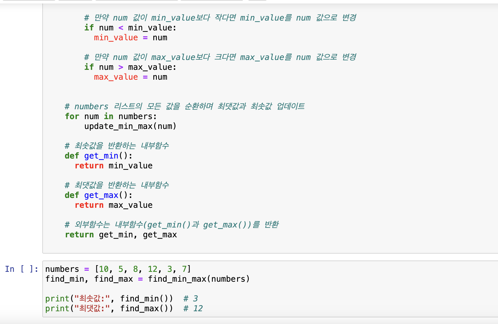
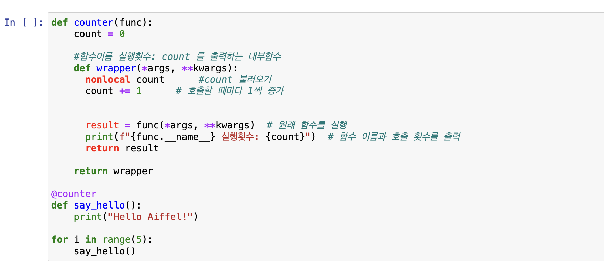
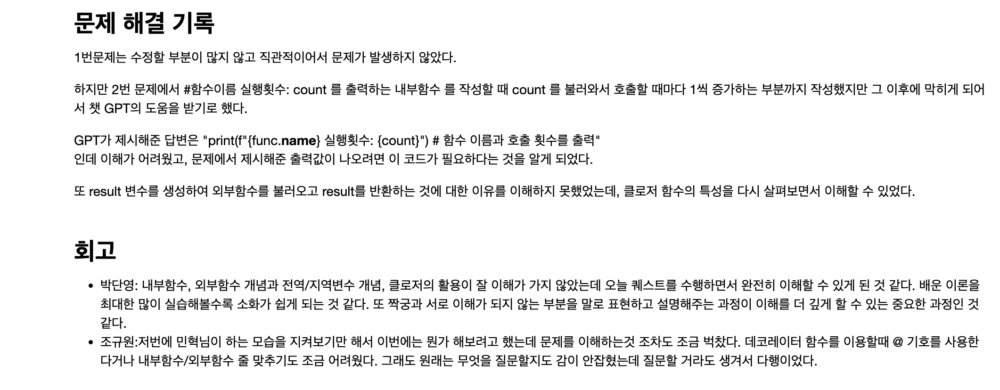

# AIFFEL Campus Online Code Peer Review Templete
- 코더 : 조규원
- 리뷰어 : 김우찬


# PRT(Peer Review Template)
- [x]  **1. 주어진 문제를 해결하는 완성된 코드가 제출되었나요?**
    - 코드가 완성되었고, 화면공유를 통해 진행하는 과정도 잘 확인시켜주셨습니다.
        
        
        
    
- [x]  **2. 전체 코드에서 가장 핵심적이거나 가장 복잡하고 이해하기 어려운 부분에 작성된 
주석 또는 doc string을 보고 해당 코드가 잘 이해되었나요?**
    - Q1의 경우 특별히 어려운 코드는 없었습니다.
    - Q2의 경우 '*args', "* *kwargs" 코드를 잘 이해하지 못했고, 리뷰어 역시 잘 이해하지 못한 상태여서 도움을 드리지는 못했습니다.
        
- [x]  **3. 에러가 난 부분을 디버깅하여 문제를 해결한 기록을 남겼거나
새로운 시도 또는 추가 실험을 수행해봤나요?**
    - 문제 해결 기록을 아랫부분에 작성해주셨습니다.
    - Q1의 경우 문제가 따로 없었고, Q2의 경우 ".__name__"를 사용하는 부분에 대해 문제해결을 위한 GPT 활용한 부분에 대한 언급이 있었습니다.
            

        
- [x]  **4. 회고를 잘 작성했나요?**
    - 회고를 잘 작성해주셨습니다. 이전 퀘스트에 비해 조금이라도 기여할 수 있는 부분이 있었다는 느낌을 적어주셨는데, 굉장한 공감이 되었습니다.
        
        
- [x]  **5. 코드가 간결하고 효율적인가요?**
    - 효율적으로 잘 작성해주셨습니다.


# 회고(참고 링크 및 코드 개선)
```
저희 조에서 진행할 때 if문의 경우 elif, else를 반드시 작성하여 완결을 지어야한다고 생각했는데, 규원님의 경우 if 2문장으로 더 간결하게 잘 작성해주신 것 같습니다.
if 문에 대한 저 스스로의 학습이 더 필요할 것 같고, 저희 팀원, 저, 그리고 리뷰를 하는 코더 규원님 역시 argument문에 대한 이해도가 부족하여 추가적인 학습이 필요합니다.
작성하시느라 고생 많으셨습니다.

```
