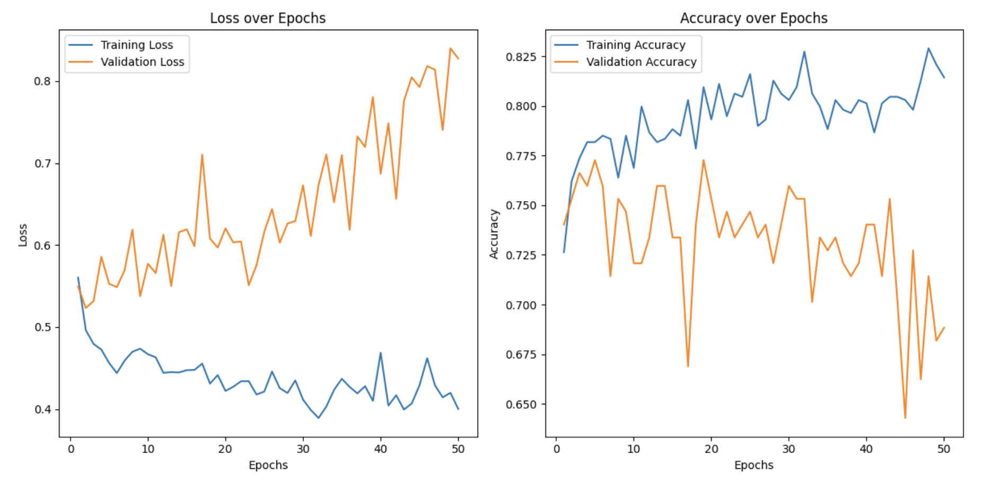
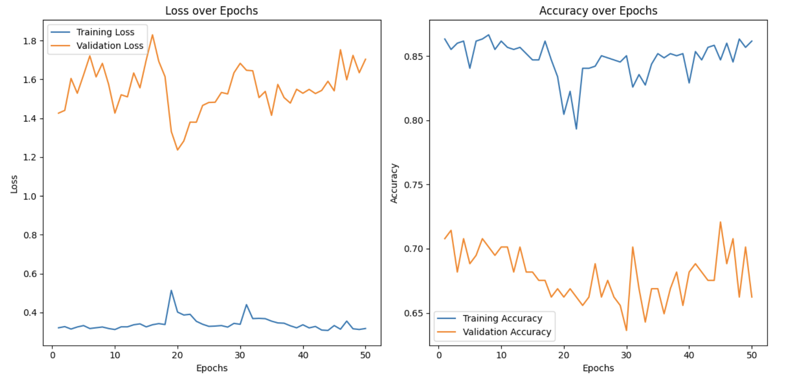

# AIFFEL Campus Online Code Peer Review Templete
- 코더 : 조규원
- 리뷰어 : 김우찬


# PRT(Peer Review Template)
- [x]  **1. 주어진 문제를 해결하는 완성된 코드가 제출되었나요?**
    - 문제는 해결하지 못했지만, 목표하고자하는 코드는 완성되었습니다.
    - 
    
- [ ]  **2. 전체 코드에서 가장 핵심적이거나 가장 복잡하고 이해하기 어려운 부분에 작성된 
주석 또는 doc string을 보고 해당 코드가 잘 이해되었나요?**
    - 코드에 대한 주석과 설명은 부족합니다.
    - 다만, 피어리뷰시간에 구두로 설명해주셨습니다.
    - 당뇨 데이터를 가져와서, 코드를 수정하고 작업한 부분에 대해 충분히 인지하였습니다.
        
- [ ]  **3. 에러가 난 부분을 디버깅하여 문제를 해결한 기록을 남겼거나
새로운 시도 또는 추가 실험을 수행해봤나요?**
    - 코드에서 loss가 줄지 않고, accuracy가 높아지지 않았습니다.
    - learning rate, depth, 너비, activation function 등을 조정하여 결과를 확인하였지만, 해답은 찾지 못하였습니다.
        
- [x]  **4. 회고를 잘 작성했나요?**
    - 어려웠던 부분에 대한 기록이 있고, 구두로도 설명을 잘 해주셨습니다.
    - 
        
- [x]  **5. 코드가 간결하고 효율적인가요?**
    - 충분히 간결하다고 판단합니다.

# 회고(참고 링크 및 코드 개선)
```
# 
- 김우찬 : 고생 많으셨습니다. 시간이 조금 더 충분했다면 좋은 결과물을 냈을 것으로 생각합니다. 추가적으로 학습하여 loss나 accuracy를 높일 방법에 대해 연구하고, 코드에 대해 조금 더 이해하는 시간을 가지면 좋겠습니다.
```
