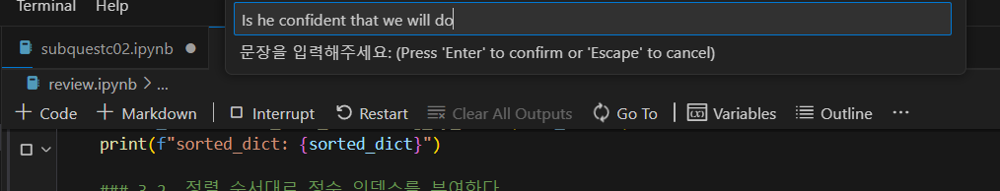
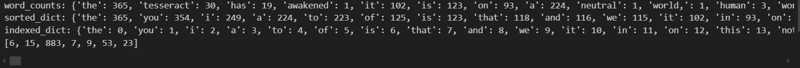
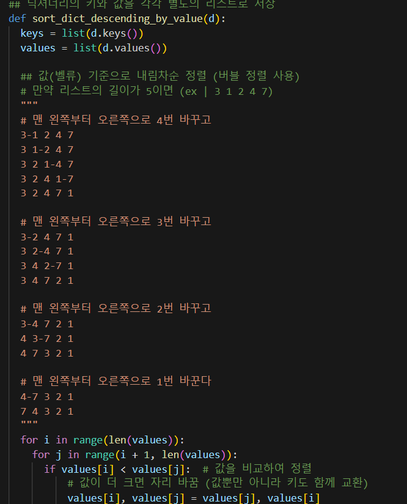

# AIFFEL Campus Online Code Peer Review Templete
- 코더 : 조규원
- 리뷰어 : 안진덕


# PRT(Peer Review Template)
- [O]  **1. 주어진 문제를 해결하는 완성된 코드가 제출되었나요?**
    - 문제를 잘 풀었습니다.
        
        
    
- [O]  **2. 전체 코드에서 가장 핵심적이거나 가장 복잡하고 이해하기 어려운 부분에 작성된 
주석 또는 doc string을 보고 해당 코드가 잘 이해되었나요?**

   
  
   버블 정렬을 사용하는 부분이 인상 깊었습니다. 
        
- [X]  **3. 에러가 난 부분을 디버깅하여 문제를 해결한 기록을 남겼거나
새로운 시도 또는 추가 실험을 수행해봤나요?**
    문제 해결을 한 흔적은 많이 보였으나 흔적을 기록하지는 않았다고 하였습니다.
        
- [X]  **4. 회고를 잘 작성했나요?**
    회고는 없었습니다.
        
- [O]  **5. 코드가 간결하고 효율적인가요?**
    간결한지는 잘 모르겠습니다. 진도에 비추어 볼때 버블 정렬을 써야만 했지만. 


# 회고(참고 링크 및 코드 개선)
```
버블 정렬을 사용한 것이 아주 인상 깊었습니다. 간단한 알고리즘이지만 진도에 맞게 문제를 너무 잘 푸셨습니다. 
코드가 길어지는건 어쩔 수가 없는 것 같았습니다. 고민한 흔적이 많이 보이는 좋은 결과였습니다.
```
